# Horror art portfolio

For the Code Institute Bootcamp Hackathon #1, our team decided to complete the art portfolio project. We were inspired by the works of H.R.Giger and Zdzyslaw Beksinski and their particular brands of surrealist horror. By combining their styles, we created a fake artist named Z.D.Gigerowski. This static webpage made with HTML, CSS and Bootstrap is his portfolio.

## Features 

### User stories

- __Sitewide__

  - As a visitor, I want the portfolio website to be mobile-responsive, so that I can view and explore artworks on my smartphone or tablet device.
  
  
  
  
  

&#10003; All pages are fully functional on mobile devices

- __Homepage__

  - As a user, I want to see highlights of the artist's recent work so that I can quickly and easily learn about their skills.
  - As the artist, I want to have a scroll through experience showing off my best works so that I can impress the audience.

  
  
  

&#10003; Three hero images on the home page showcase a blurred version of the latest works in the artists three main styles. Each hero image also contains a brief description of the specific style and a call to action to explore that style further in the gallery.

&#10003; Home page scrolls through hero images cleanly

- __Navigation__

  - As a user, I want an attractive and simple navigation bar on every page so that I can easily navigate through the website.

  

&#10003; Navigation bar is simple and functional on desktop

  

&#10003; Navigation on mobile is a toggled drop down button

&#10003; Text borders change color on mobile to provide more contrast for accessibility.

- __Contact__
 
  - As a user, I want to be able to contact the artist directly through the portfolio website (e.g., via a contact form or email), so that I can inquire about purchasing artwork or commissioning a custom piece.

  
  

&#10003; Call to action on the home page that redirects to the contact page with a contact form to get in touch.

  - As a user, I want to chat to the artist directly through a chat window in order to ask questions in real time.

      &#10023; Not feasible 

- __Gallery__

  - As a user, I want access to a gallery of the artist's work so that I can view it easily.

  
  

&#10003; Fully responsive page

  - As a user, I want access to high resolution versions of the art work so that I can properly view the artist's art.
  - As a user, I want the high quality images to open in a new tab so that I can keep exploring the main website from where I was.

  

&#10003; Note the link which will open into a new tab with a high resolution version of the image

  - As a user, I want to see the titles and quick info of each piece of artwork as I hover over them so that I can learn more about them quickly.

      &#10003; Titles as seen on the card above, optional descriptor text to be added

- __About__

  - As a user, I want to see pictures of the artist so that I can get to know them more.
  - As the artist I want pictures of myself shown to the user so that I can present myself well.
  - As a user, I want to see the artist's biography so that I can learn more about them.

  
  

&#10003; Wireframe in MoSCoW followed precicely

  - As a user, I want to see a timeline of the artist's work/life so that I can quickly learn about their journey as an artist.

      &#10003; Detailed biography sections made a timeline unnecessary

- __Merchandise__

  - As a user, I want the ability to purchase some art directly from the website so that I can easily support the artist.

  

&#10003; All products are commisioned pieces so contacting the artist is the best way to make a purchase

- __Footer__

  - As a user, I want to see clickable social links in the footer so that I can easily go to the artist's socials to keep up to date with them.
  - As the artist, I want to have clickable social links in the footer of the website so that I can increase traffic to them.
  - As the artist, I want my copyrights to be visible in the footer so that I can protect my IP.
  - As a user, I want back to top button on the footer so that I can return to the top of the page with only 1 click.

  

&#10003; Footer covers all the above user stories, all footer links and buttons change color on float for accesibility

  - As a user, I want to see contact information in the footer so that I can easily contact the artist.

      &#10023; The artist prefers to screen requests and has asked not to have contact information readily available but instead wants to encourage the use of the contact form page

  - As a user, I want to see a contact link in the footer so that I can easily contact the artist.

      &#10023; All nav links were removed from the footer as the nav bar would remain fixed in the viewport. This lead to a far cleaner look.
  

### MoSCoW Table

 - 

## Wireframes

- __Homepage__
  - Low fidelity
  
  - High fidelity
  

- __Gallery__
  - Low fidelity
  
  - High fidelity
  

- __About__
  - Low fidelity
  
  - High fidelity
  

- __Contact__
  - Low fidelity
  
  - High fidelity
  
  
### Existing Features

  - Static web site with 4 separate pages (Home, Gallery, About, Contact)
  - Responsive design for each page allowing use on mobile and desktop
- __Header__
  - Sticky header.
  - NavBar in header linking to all for pages 	(Home, Gallery, About, Contact).
  - Active page is shown in Navbar.
  - Logo and website title in Navbar link to homepage.
  - Responsive Nav drop down menu on mobile; navbar links disappear and burger icon appears.
  - Responsive Nav drop down menu font style changes, increasing readability on mobile.
  - Responsive title of page changes from “Z.D.Gigerowski” to “Z.D.G” on mobile.
- __Homepage__
  - Scroll through highlights with 3 stages
  - First stage has a background image of a piece of artwork which is parallax
  - Second stage and third stage have static background images of 2 other pieces of artwork
  - All 3 stages include text content and a button with a call to action
  - First stage and second stage buttons link to Gallery page
  - Third stage button links to  Contact page
  - Responsive page layout across mobile and desktop
- __Gallery page__
  - Download image icons link to new tab with high quality images for each art piece.
  - Responsive page layout across mobile and desktop
  - __About Page__
  - Parallax background image
  - Responsive page layout across mobile and desktop
 - __Contact Page__
  - Form input placeholders disappear once text boxes are filled in
  - Responsive page layout across mobile and desktop
- __Footer__
  - Sticky footer
  - Back to top button
  - Social links for Facebook, Youtube, Instagram and Twitter(X) link to their respective websites homepage

### Features We'd implement in the future if we could

  - A dedicated shop/merchendise page for purchase artwork or custom pieces
  - Secure purchases
  - Time line of the artist's life pointing out key/inspiring events
  - Working email form

## Testing 

### Feature Testing

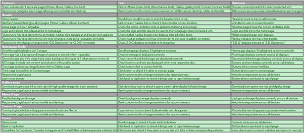

### Validator Testing 

- __No errors in our CSS were found first try!__

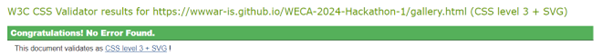

- __When validating the HTML...__

  - 7 warnings were identified

  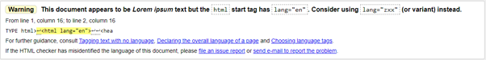

  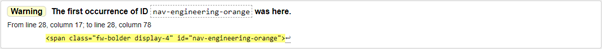

  

  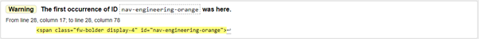

  

  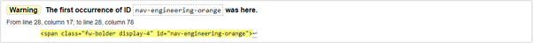

  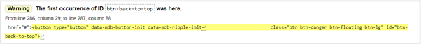

  - 10 errors were identified

  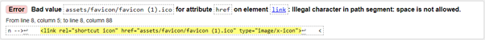

  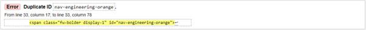

  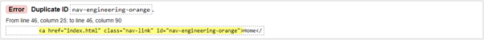

  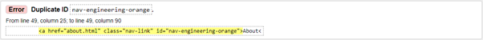

  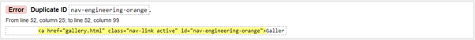

  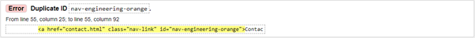

  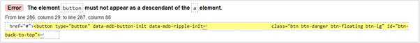

  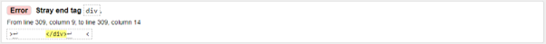

  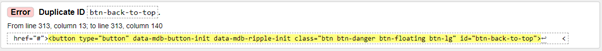

  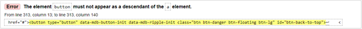

### Identified Bugs

  - Navbar logo did not link to index.html
  - SOLUTION- Add correct href to the anchor element

 

## Deployment

- __Via github pages in the repo settings menu__

  - 

  - 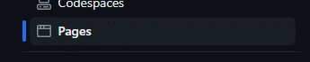

- __Selected main branch and /root and clicked save__

  - 

  - 

## Credits 

### Content 

 - Chat Gpt was used for the written paragrpahs on the about page : https://chat.openai.com/

### Media

 - Artist photos used on the about page are from @cottonbro on pexels : https://www.pexels.com/@cottonbro/
   - zdg-blackandwhite.jpg - https://www.pexels.com/photo/tired-man-resting-on-wooden-chair-3779062/ 
   - zdg-painting.jpg - https://www.pexels.com/photo/man-in-black-long-sleeves-standing-near-easel-3778997/
   - zdg-thinking.jpg - https://www.pexels.com/photo/side-view-photo-of-elderly-man-holding-a-paint-brush-3778998/
 - Art images were created using canva pro : https://www.canva.com/en_gb/